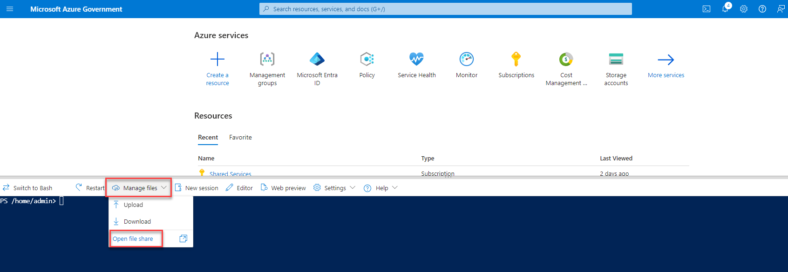
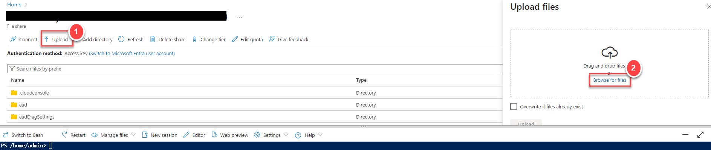
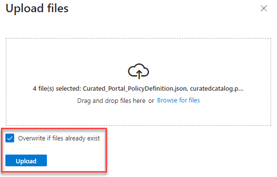

# Implementing Curated Portal policy on a new tenant (via Script)

This folder contains following files.

|  Name                                           |  Notes                                                                                  |
|:------------------------------------------------|:----------------------------------------------------------------------------------------|
| `Curated_Portal_PolicyDefinition.json`          | Contains **Azure Policy Definition** to be used for Curated Portal Policy               |
| `JWCC_Gov_Final_<Month>_<Year>_<Version>.json`  | Contains **latest JWCC Catalog** to be used as parameter value for Policy Assignment    |
| `Parameters.json`                               | Contains **Azure Policy Parameters** to be used for Curated Portal Policy               |
| `curatedcatalog.ps1`                            | PowerShell Script to create Curated Portal Policy Definition/Assignment                   |

**Note** - Name of the file `JWCC_Gov_Final_<Month>_<Year>_<Version>.json` will change as JWCC Catalog gets updated over time.

**Example file name** - `JWCC_Gov_Final_June_2024_4.0.json`

|  Descriptor |  Notes                         |
|:------------|:-------------------------------|
| `<Month>`   | Indicates Month (e.g. `June`)  |
| `<Year>`    | Indicates Year (e.g. `2024`)   |
| `<Version>` | Indicates Version (e.g. `4.0`) |

## There are two ways one can create Curated Portal Policy

1. [Create curated portal policy using Azure Cloud Shell](#1-create-curated-portal-policy-using-azure-cloud-shell)
2. [Create curated portal policy using Azure Cli](#2-create-curated-portal-policy-using-azure-cli)

### 1. Create curated portal policy using Azure Cloud Shell

1. Download following files from [GitHub Repo's Script folder](https://github.com/Azure/jwcc-curated-portal/tree/main/Azure%20Government/AzurePolicyFiles-CuratedPortal/Script) and store locally on your machine.

    - `Curated_Portal_PolicyDefinition.json`
    - `JWCC_Gov_Final_<Month>_<Year>_<Version>.json`
    - `Parameters.json`
    - `curatedcatalog.ps1`

2. Log in to **Azure Portal** using **Global Administrator** user account.

3. Make sure this account has **Owner** role assignment at **Tenant Root Group** scope.

4. Launch **Azure Cloud Shell** in **PowerShell** mode.

5. Select **Manage files** and then select **Open file share**.

    

6. Click on **Upload** and then click on **Browse for files** on **Upload files** page.

    

7. Select all the files downloaded in step 1 and click **Open**.

8. Select **Overwrite if files already exist** and then click on **Upload**. Now you should have all these files in your **clouddrive**.

    

9. In **Azure Cloud Shell**, type `cd clouddrive`.

10. Run following command to run the script to create Azure Policy Definition, Register Microsoft.PolicyInsights resource provider and Policy Assignment.

    **`./curatedcatalog.ps1 -folderPath <folderPath> -allowListFileName <allowListFileName>`**

    **Note** - Before running the command replace following placeholders with appropriate values ...

    |  Placeholder name     |  Comment                                                                                       |
    |:----------------------|:-----------------------------------------------------------------------------------------------|
    | `<folderPath>`        | Provide folder path where files are uploaded in `clouddrive` (e.g. `/home/admin/clouddrive/`)  |
    | `<allowListFileName>` | Provide file name containing allow list (e.g. `"JWCC_Gov_Final_June_2024_4.0.json"`) |

11. Successful run of above command will create following two resoruces - if you have used default names provided in the script.

    |  Type             |  Name                                            |
    |:----------------- |:-------------------------------------------------|
    | Policy Definition | `JWCC Curated Catalog - Allowed Resources Types` |
    | Policy Assignment | `JWCC Curated Catalog`                           |

### 2. Create curated portal policy using Azure Cli

1. Download following files from [GitHub Repo's Script folder](https://github.com/Azure/jwcc-curated-portal/tree/main/Azure%20Government/AzurePolicyFiles-CuratedPortal/Script) and store locally on your machine.

    - `Curated_Portal_PolicyDefinition.json`
    - `JWCC_Gov_Final_<Month>_<Year>_<Version>.json`
    - `Parameters.json`
    - `curatedcatalog.ps1`

2. Launch **Azure Cli** on your local machine.

3. Log in to Azure using **az login** command with **Global Administrator** user account.

4. Make sure this account has **Owner** role assignment at **Tenant Root Group** scope.

5. Run following command to run the script to to create Azure Policy Definition, Register Microsoft.PolicyInsights resource provider and Policy Assignment. 

    **`.\curatedcatalog.ps1 -folderPath <folderPath> -allowListFileName <allowListFileName>`**

    **Note** - Before running the command replace following placeholders with appropriate values ...

    |  Placeholder name     |  Comment                                                                                       |
    |:----------------------|:-----------------------------------------------------------------------------------------------|
    | `<folderPath>`        | Provide folder path where files are downloaded on your local machine (e.g. `C:\Temp\Scripts\`)  |
    | `<allowListFileName>` | Provide file name containing allow list (e.g. `"JWCC_Gov_Final_June_2024_4.0.json"`) |

6. Successful run of above command will create following two resoruces - if you have used default names provided in the script.

    |  Type             |  Name                                            |
    |:----------------- |:-------------------------------------------------|
    | Policy Definition | `JWCC Curated Catalog - Allowed Resources Types` |
    | Policy Assignment | `JWCC Curated Catalog`                           |
